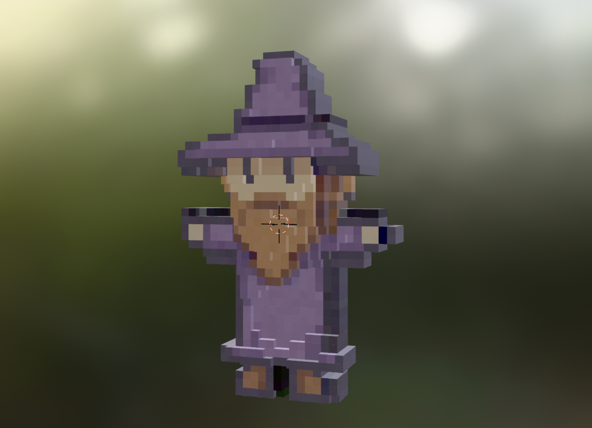

# Creating a 3d Voxel based on the GPT images

1. Use GPT to generate a t-pose image
2. Generate a depth map of that image using MiDas (https://huggingface.co/spaces/pytorch/MiDaS)
3. Run the python script in blender to generate the voxel character

## Results

## Next steps

1. This script just generates the image of the front. We need to generate multiple views (i.e. front / back / side) and combine them into a single voxel map.
2. Actually run the MiDaS model. I just manually clipped up the images and generated teh depth map using their web interface.
3. Run the full script end to end

- Take the 3 images
- Generate the depth map
- Pass to blender to create the voxel
- Combine and save the voxel down to a 3d file

## Next next steps

1. Ideally we'll want to add a skeleton to this model so we can move the arms and legs around
2. Once we have a skeleton, we can animate the model into the required poses, screencap each pose, apply some color correction / cleanup, and we'll have our assets.
